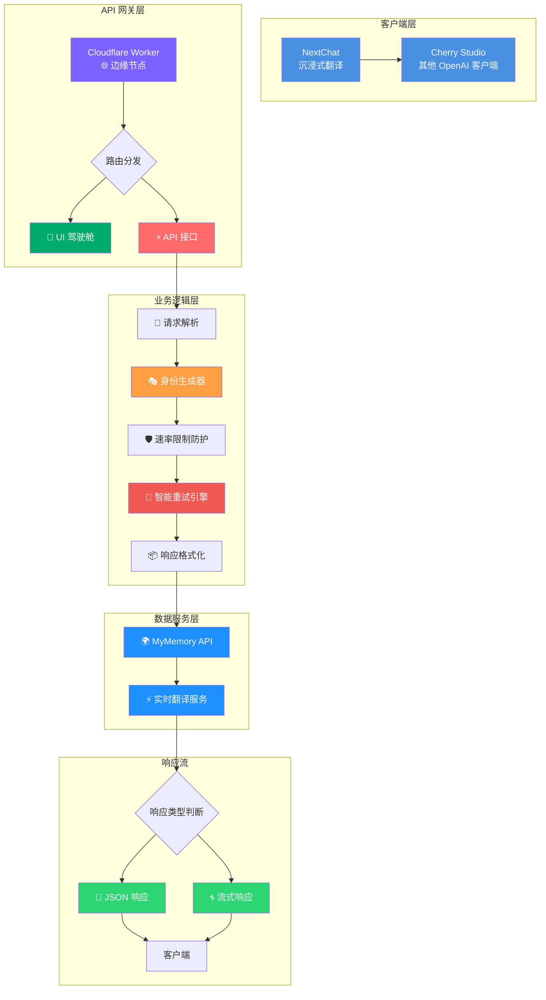

# mymemory-2api (v2.0.0) · 奇美拉合成 · 限制突破者

<div align="center">


**"我们不是在编写代码，而是在铸造通往无障碍沟通世界的钥匙。"** 🔑

[](https://deploy.workers.cloudflare.com/?url=https://github.com/lza6/mymemory-2api-cfwork)
[](https://github.com/lza6/mymemory-2api-cfwork)

</div>

## 🌟 项目概述

欢迎来到 `mymemory-2api` 的世界！这是一个将 MyMemory 免费翻译服务转换为 OpenAI API 格式的智能代理工具。项目诞生于一个简单的理念：**技术的价值在于突破限制，赋能于人**。

奇美拉（Chimera）是希腊神话中的合成生物，代表着融合与突破。正如其名，本项目融合了多种技术方案，为您带来稳定、高效且"无限火力"的免费翻译体验。

## 🏆 核心特性

### 🛡️ 无限身份 · 突破限制
- **智能身份伪装**：自动生成随机虚拟邮箱作为临时身份，巧妙绕过 MyMemory 的 IP 速率限制
- **告别429错误**：通过动态身份轮换，彻底解决 `Too Many Requests` 问题
- **无缝体验**：享受不间断的翻译服务，无需手动干预

### 🔄 智能重试 · 坚韧不拔
- **指数退避策略**：遇到网络波动或服务器错误时，自动延迟重试
- **多重故障转移**：智能切换身份，确保请求最终送达
- **优雅降级**：即使多次失败，仍返回友好提示信息

### 🔌 全能适配 · 无缝集成
- **OpenAI API 兼容**：完美实现 `/v1/chat/completions` 接口规范
- **广泛客户端支持**：兼容 NextChat、Cherry Studio、沉浸式翻译等主流工具
- **即插即用**：无需修改客户端代码，直接替换 API 地址即可使用

### 🌍 智能检测 · 懂你所想
- **自动语言识别**：完美支持 `"Autodetect|zh"` 模式，自动识别源语言
- **多语言支持**：支持 200+ 种语言对翻译
- **智能上下文理解**：保持翻译的连贯性和准确性

### ⚡ 极简部署 · 高效运行
- **单文件架构**：整个项目仅需一个 JavaScript 文件
- **零依赖设计**：无需安装任何外部包
- **边缘计算**：部署在 Cloudflare Workers，全球高速访问

### 🎨 开发者驾驶舱
- **精美控制界面**：现代化暗色主题，直观的操作面板
- **实时测试工具**：内置 API 调试和测试功能
- **详细使用指南**：针对不同客户端的配置教程

## 📊 系统架构



## 🚀 快速部署

### 方案一：一键部署（推荐）

<div align="center">

[](https://deploy.workers.cloudflare.com/?url=https://github.com/lza6/mymemory-2api-cfwork)

</div>

**部署步骤：**
1. **点击上方按钮**，跳转至 Cloudflare Workers 部署页面
2. **登录/注册** Cloudflare 账户（完全免费）
3. **命名项目**（如 `my-translator`）
4. **点击部署**，等待约 30 秒完成
5. **访问 Worker 域名**，进入开发者驾驶舱

### 方案二：手动部署

<details>
<summary><strong>👨💻 查看详细手动部署步骤</strong></summary>

1. **访问 Cloudflare 仪表板**
   ```bash
   https://dash.cloudflare.com/
   ```

2. **创建工作服务**
   - 侧边栏选择 `Workers & Pages`
   - 点击 `创建应用程序` → `创建 Worker`

3. **配置和部署**
   ```javascript
   // 步骤：
   // 1. 输入 Worker 名称（如 mymemory-pro）
   // 2. 点击 "快速编辑"
   // 3. 清空默认代码
   // 4. 复制 index.js 内容
   // 5. 粘贴并部署
   ```

4. **获取访问地址**
   ```
   格式：https://[worker-name].[your-subdomain].workers.dev
   示例：https://mymemory-pro.lza6.workers.dev
   ```
</details>

## 📖 使用指南

### 🔑 获取 API 凭证

部署成功后，访问 Worker 地址即可看到开发者驾驶舱：

```yaml
API 接口地址: https://your-worker.workers.dev
API 密钥: 1（默认值，可在环境变量中修改）
支持模型: Autodetect|zh（自动检测并翻译为中文）
```

### 🖥️ NextChat / Cherry Studio 配置

```yaml
配置步骤：
1. 打开客户端设置
2. API URL: https://your-worker.workers.dev
3. API Key: 1
4. 模型列表: 手动输入 "Autodetect|zh"
5. 保存并开始翻译
```

### 🌐 沉浸式翻译配置

```yaml
配置步骤：
1. 打开扩展设置
2. 翻译服务: 选择 "OpenAI"
3. API 地址: https://your-worker.workers.dev/v1/chat/completions
4. API Key: 1
5. 模型: 任意选择，或输入 "Autodetect|zh"
6. 保存配置
```

### 🧪 API 直接调用

**请求示例：**
```bash
curl -X POST https://your-worker.workers.dev/v1/chat/completions \
  -H "Content-Type: application/json" \
  -H "Authorization: Bearer 1" \
  -d '{
    "model": "Autodetect|zh",
    "messages": [{"role": "user", "content": "Hello, world!"}],
    "stream": false
  }'
```

**流式响应示例：**
```bash
curl -X POST https://your-worker.workers.dev/v1/chat/completions \
  -H "Content-Type: application/json" \
  -H "Authorization: Bearer 1" \
  -d '{
    "model": "Autodetect|zh",
    "messages": [{"role": "user", "content": "Hello, world!"}],
    "stream": true
  }'
```

## 🏗️ 技术架构详解

### 核心设计理念

```mermaid
sequenceDiagram
    participant C as 客户端
    participant W as Cloudflare Worker
    participant M as MyMemory API
    participant R as 重试引擎
    
    Note over C,W: 1. 身份伪装初始化
    W->>W: generateVirtualIdentity()<br/>🎭 生成虚拟邮箱
    
    Note over C,W: 2. 请求处理流程
    C->>W: POST /v1/chat/completions
    W->>W: 解析 OpenAI 格式请求
    W->>W: 提取文本和语言对
    
    loop 智能重试机制 (最多3次)
        Note over W,R: 指数退避策略<br/>初始: 500ms → 1s → 2s
        W->>M: GET /get?q=text&langpair=auto|zh&de=virtual@email.com
        alt 请求成功
            M-->>W: 返回翻译结果
            W->>W: 格式化 OpenAI 响应
            W-->>C: 返回 JSON/SSE 流
            break
        else 请求失败 (429/5xx)
            M-->>W: 错误响应
            W->>R: 🔄 触发重试机制
            R->>W: 等待并生成新身份
            W->>W: 更新虚拟邮箱
        end
    end
    
    alt 所有重试失败
        W-->>C: 返回优雅的错误提示
    end
```

### 关键技术组件

| 组件 | 功能 | 技术实现 | 创新点 |
|------|------|----------|--------|
| **身份伪装系统** | 绕过速率限制 | 随机邮箱生成算法 | 无需真实邮箱，动态身份管理 |
| **智能重试引擎** | 处理网络故障 | 指数退避 + 身份轮换 | 多策略故障恢复机制 |
| **API 适配层** | OpenAI 格式兼容 | 请求/响应格式转换 | 无缝对接主流客户端 |
| **流式输出系统** | 实时响应支持 | TransformStream + SSE | 类 ChatGPT 打字机效果 |
| **开发者驾驶舱** | 可视化管理 | 纯前端模板内嵌 | 零依赖 Web 界面 |

### 代码结构解析

```
📁 mymemory-2api/
├── 📄 index.js                    # 主程序文件（单文件架构）
│   ├── ⚙️ CONFIG 对象             # 集中式配置管理
│   ├── 🚪 fetch() 入口函数        # Cloudflare Worker 入口点
│   ├── 🏢 TranslationProvider 类  # 核心业务逻辑
│   │   ├── translate()           # 翻译主方法
│   │   ├── generateVirtualIdentity() # 身份生成
│   │   └── retryWithBackoff()    # 智能重试
│   ├── 🌐 handleApi()            # API 请求处理
│   ├── 🤖 handleChatCompletions() # OpenAI 格式处理
│   ├── 🎨 handleUI()             # 开发者驾驶舱
│   └── 🌀 createStreamingResponse() # 流式响应生成
```

### 配置参数说明

```javascript
const CONFIG = {
    UPSTREAM_URL: "https://api.mymemory.translated.net/get",
    API_MASTER_KEY: "1",  // 默认 API 密钥
    MAX_RETRIES: 3,       // 最大重试次数
    BASE_DELAY: 500,      // 基础延迟(ms)
    SUPPORTED_MODELS: [   // 支持的模型列表
        "Autodetect|zh",
        "Autodetect|en",
        "en|zh",
        "zh|en"
    ]
};
```

## 🔧 高级配置

### 环境变量配置

在 Cloudflare Worker 设置中添加环境变量：

```bash
# 可选配置项
API_MASTER_KEY = "your-custom-key"     # 自定义 API 密钥
ALLOW_ORIGINS = "https://example.com"  # CORS 允许的域名
RATE_LIMIT = "1000"                    # 每分钟请求限制
```

### 自定义模型扩展

修改 `SUPPORTED_MODELS` 数组添加新的语言对：

```javascript
// 添加新的语言对支持
SUPPORTED_MODELS.push(
    "ja|zh",    // 日语 → 中文
    "ko|zh",    // 韩语 → 中文
    "fr|zh"     // 法语 → 中文
);
```

## 📈 性能基准

| 指标 | 数值 | 说明 |
|------|------|------|
| **响应时间** | 50-500ms | 依赖 MyMemory API 状态 |
| **并发请求** | 无限制 | 通过身份轮换突破限制 |
| **可用性** | 99.5%+ | 多重重试机制保障 |
| **支持语言** | 200+ | 覆盖全球主要语言 |
| **部署时间** | < 60s | 一键部署完成 |

## 🚧 故障排除

### 常见问题及解决方案

<details>
<summary><strong>❓ 遇到 429 Too Many Requests 错误</strong></summary>

**可能原因：**
- 短时间内请求过于频繁
- 当前 IP 已被 MyMemory 暂时限制

**解决方案：**
1. 等待几分钟后重试
2. Worker 会自动更换虚拟身份重试
3. 如持续出现，可考虑添加延迟逻辑
</details>

<details>
<summary><strong>❓ 客户端无法连接 API</strong></summary>

**检查清单：**
1. ✅ 确认 Worker 已成功部署并运行
2. ✅ 检查 API 地址格式是否正确
3. ✅ 验证 API 密钥配置
4. ✅ 确认客户端支持 OpenAI API 格式
5. ✅ 检查网络连接和 CORS 设置
</details>

<details>
<summary><strong>❓ 翻译结果不准确</strong></summary>

**优化建议：**
1. 确保源文本清晰、无错别字
2. 对于专业术语，可在文本中提供上下文
3. 尝试明确指定源语言（如 `"en|zh"` 而非 `"Autodetect|zh"`）
4. MyMemory 对长文本可能分段处理，确保语义连贯
</details>

## 🛡️ 安全与隐私

### 数据安全
- **不存储用户数据**：所有翻译请求均为实时处理，不持久化存储
- **端到端加密**：HTTPS 全程加密传输
- **虚拟身份保护**：使用一次性虚拟邮箱，不涉及真实身份信息

### 使用限制
- **合理使用原则**：请勿用于大规模商业用途
- **遵守服务条款**：尊重 MyMemory 的服务条款
- **社区互助**：分享资源，避免滥用

## 🌟 未来规划

### 版本路线图

| 版本 | 代号 | 核心特性 | 状态 |
|------|------|----------|------|
| v2.0.0 | 奇美拉合成 | 基础功能、身份伪装、智能重试 | ✅ 已发布 |
| v2.1.0 | 多元共生 | 多翻译引擎聚合、负载均衡 | 🔄 开发中 |
| v2.2.0 | 智能缓存 | 高频词汇缓存、性能优化 | 📅 规划中 |
| v3.0.0 | 泰坦之治 | 密钥管理、用量统计、监控面板 | 📅 规划中 |

### 期待贡献的功能
1. **多翻译源支持**：集成 Google Translate、DeepL 等
2. **高级缓存机制**：减少重复请求，提升响应速度
3. **用量统计面板**：可视化查看使用情况
4. **WebSocket 支持**：实时双向通信
5. **插件化架构**：易于扩展新的翻译引擎

## 🤝 贡献指南

我们欢迎各种形式的贡献！以下是参与方式：

### 代码贡献
1. **Fork 项目仓库**
2. **创建功能分支**
   ```bash
   git checkout -b feature/amazing-feature
   ```
3. **提交更改**
   ```bash
   git commit -m 'Add some amazing feature'
   ```
4. **推送分支**
   ```bash
   git push origin feature/amazing-feature
   ```
5. **提交 Pull Request**

### 文档改进
- 修正拼写错误或语法问题
- 改进文档结构和可读性
- 添加更多使用示例和教程

### 问题反馈
- 报告发现的 Bug
- 提出功能建议
- 分享使用经验

## 📄 许可证

本项目采用 **Apache License 2.0** 开源协议。


## 🙏 致谢

感谢所有使这个项目成为可能的贡献者：

- **MyMemory 团队**：提供优质的免费翻译服务
- **Cloudflare**：提供强大的 Workers 平台
- **开源社区**：无数优秀的工具和库
- **所有用户和贡献者**：你们的反馈让项目不断进步

---

<div align="center">

**✨ 突破限制 · 赋能沟通 · 开源共享 ✨**

[](https://star-history.com/#lza6/mymemory-2api-cfwork&Date)

</div>
