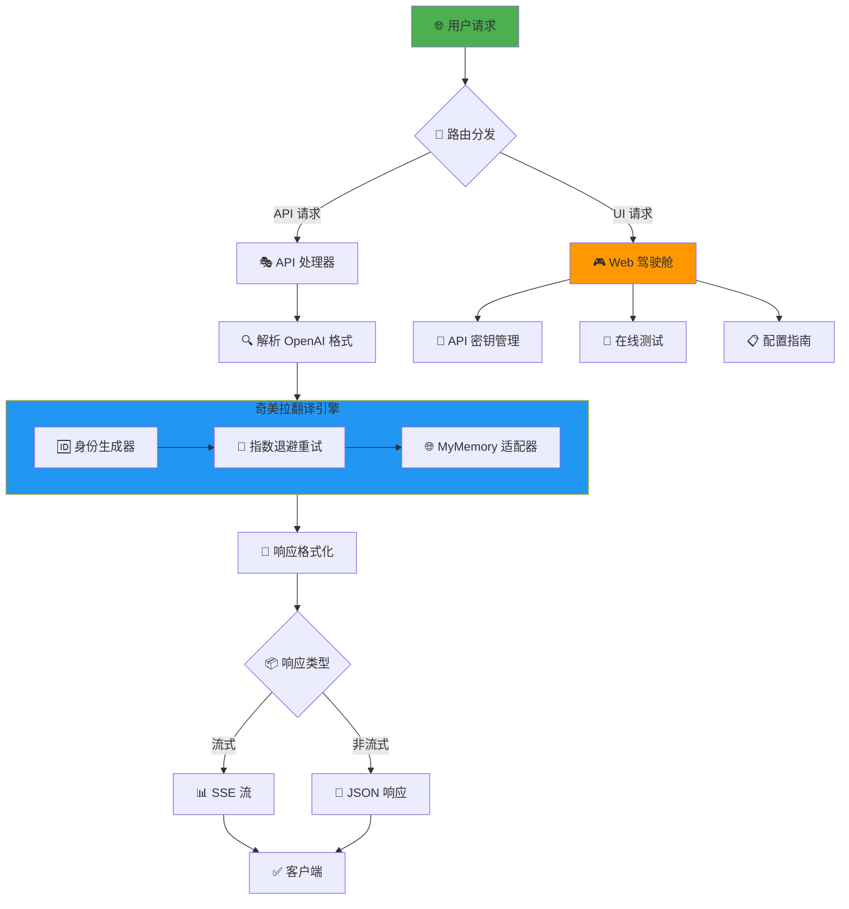
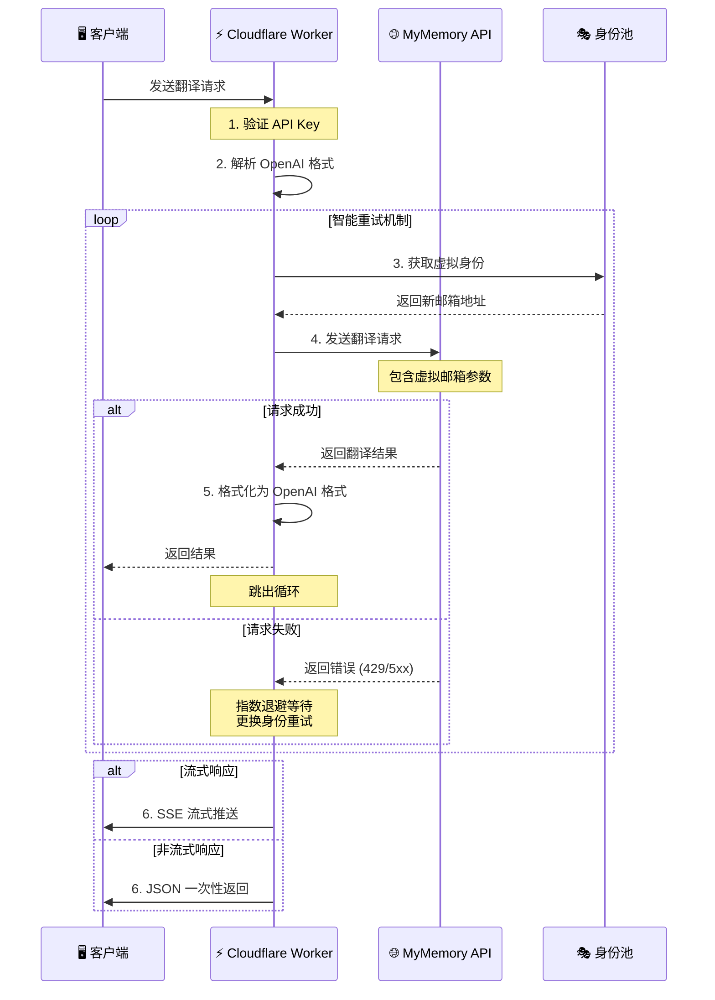
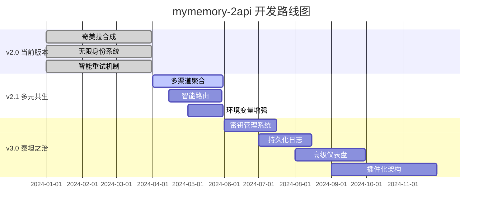

# mymemory-2api (v2.0.0) - 奇美拉合成 · 限制突破者


**"我们不是在编写代码，我们是在铸造通往无障碍沟通世界的钥匙。"** 🔑

欢迎来到 `mymemory-2api` 的世界！这不仅是一个将 MyMemory 免费翻译服务转换为 OpenAI API 格式的工具，更是一份宣言：**技术的价值在于突破限制，赋能于人。**

## 📋 目录
- [✨ 核心特性](#-核心特性)
- [🏗️ 系统架构](#️-系统架构)
- [🚀 一键部署](#-一键部署)
- [🛠️ 手动部署](#️-手动部署)
- [🎯 使用方法](#-使用方法)
- [⚙️ 技术原理](#️-技术原理)
- [📊 系统流程图](#-系统流程图)
- [🔮 未来规划](#-未来规划)
- [🤝 贡献指南](#-贡献指南)
- [📜 开源协议](#-开源协议)

---

## ✨ 核心特性

<div align="center">

| 特性 | 描述 | 图标 |
|------|------|------|
| 🎭 **无限身份** | 自动生成虚拟邮箱绕过速率限制 | 🔄 |
| 🧠 **智能重试** | 指数退避机制确保高可用性 | 🔄 |
| 🌐 **全能适配** | 完美兼容 OpenAI API 格式 | 🔌 |
| 🤖 **自动检测** | 支持多语言自动识别翻译 | 🌍 |
| ⚡ **单文件部署** | 轻量级，无外部依赖 | 📦 |
| 🎮 **开发者驾驶舱** | 精美 Web 界面管理控制台 | 🖥️ |

</div>

---

## 🏗️ 系统架构

<div align="center">



</div>

---

## 🚀 一键部署

### 30 秒极速部署

<div align="center">

[](https://deploy.workers.cloudflare.com/?url=https://github.com/lza6/mymemory-2api-cfwork)

</div>

**部署步骤：**

1. **点击上方按钮** → 跳转至 Cloudflare Workers 部署页面
2. **登录/注册** Cloudflare 账户（完全免费）
3. **命名项目**（如：`my-translator-pro`）
4. **点击部署** → 等待部署完成
5. **访问 Worker 域名** → 进入开发者驾驶舱

**部署成功后，您将获得：**

<div align="center">

| 🎁 资源 | 🔧 配置项 | 📝 说明 |
|--------|-----------|---------|
| **🌐 API 端点** | `https://YOUR_WORKER.workers.dev` | 主要服务地址 |
| **🔑 API 密钥** | `1`（默认） | 身份验证密钥 |
| **🖥️ 管理界面** | Worker 根路径访问 | 开发者驾驶舱 |

</div>

---

## 🛠️ 手动部署

### 分步部署指南

```bash
# 1. 访问 Cloudflare 控制台
https://dash.cloudflare.com/

# 2. 创建工作器
Workers & Pages → 创建应用程序 → 创建 Worker

# 3. 配置工作器
名称: mymemory-translator
点击: "部署"

# 4. 编辑代码
删除默认代码 → 粘贴项目代码

# 5. 保存并发布
点击: "保存并部署"
```

**文件结构：**
```
mymemory-2api/
├── 📄 index.js          # 主程序文件（单文件架构）
├── 📄 README.md         # 项目文档
└── 📄 LICENSE           # 开源协议
```

---

## 🎯 使用方法

### 场景一：NextChat / Cherry Studio

<div align="center">

```yaml
配置参数:
  API URL: https://YOUR_WORKER.workers.dev
  API Key: 1
  模型名称: Autodetect|zh
```

</div>

**配置步骤：**
1. 打开客户端设置 → API 配置
2. 填写上述参数
3. 保存并开始翻译

### 场景二：沉浸式翻译扩展

<div align="center">

```yaml
配置参数:
  服务类型: OpenAI
  API 地址: https://YOUR_WORKER.workers.dev/v1/chat/completions
  API Key: 1
  模型: Autodetect|zh
```

</div>

**配置步骤：**
1. 扩展设置 → 翻译服务
2. 选择 OpenAI
3. 填写配置参数
4. 测试连接并保存

### 🔧 开发者驾驶舱功能

<div align="center">

| 功能模块 | 图标 | 描述 |
|----------|------|------|
| **API 测试台** | 🧪 | 在线测试翻译功能 |
| **配置生成器** | ⚙️ | 自动生成客户端配置 |
| **实时日志** | 📊 | 查看请求响应日志 |
| **状态监控** | 📈 | 服务健康状态检查 |
| **文档中心** | 📚 | 快速访问使用指南 |

</div>

---

## ⚙️ 技术原理

### 🔄 无限身份机制

```javascript
class TranslationProvider {
  // 🎭 虚拟身份生成器
  static generateVirtualIdentity() {
    const chars = 'abcdefghijklmnopqrstuvwxyz0123456789';
    let user = '';
    for(let i = 0; i < 10; i++) {
      user += chars[Math.floor(Math.random() * chars.length)];
    }
    return `${user}@gmail.com`;
  }
  
  // 🧠 智能重试策略
  async translate(text, langpair, maxRetries = 3) {
    for(let attempt = 0; attempt <= maxRetries; attempt++) {
      try {
        const identity = this.generateVirtualIdentity();
        // 指数退避等待
        if(attempt > 0) {
          await new Promise(resolve => 
            setTimeout(resolve, Math.pow(2, attempt) * 500)
          );
        }
        return await this.sendRequest(text, langpair, identity);
      } catch(error) {
        if(attempt === maxRetries) throw error;
      }
    }
  }
}
```

### 📊 技术栈解析

<div align="center">

| 技术栈 | 用途 | 复杂度 | 替代方案 |
|--------|------|--------|----------|
| **Cloudflare Workers** | 边缘计算平台 | ⭐⭐ | Vercel Edge, Deno Deploy |
| **Fetch API** | HTTP 请求处理 | ⭐ | Axios, Node-fetch |
| **TransformStream** | 流式响应处理 | ⭐⭐⭐ | 自定义流实现 |
| **SSE (Server-Sent Events)** | 实时数据传输 | ⭐⭐ | WebSocket, Long Polling |
| **指数退避算法** | 智能重试策略 | ⭐⭐ | p-retry 库 |
| **OpenAI API 兼容层** | 格式转换适配 | ⭐⭐ | 自定义 API 规范 |

</div>

---

## 📊 系统流程图

<div align="center">



</div>

---

## 🔮 未来规划

### 🚧 路线图

<div align="center">



</div>

### 🎯 版本特性对比

<div align="center">

| 特性 | v2.0 (当前) | v2.1 (规划) | v3.0 (规划) |
|------|-------------|-------------|-------------|
| **翻译源** | MyMemory | 多源聚合 | 插件化扩展 |
| **身份管理** | 虚拟邮箱 | 智能轮换 | 身份池管理 |
| **配置方式** | 代码配置 | 环境变量 | 可视化配置 |
| **监控功能** | 基础日志 | 增强日志 | 完整仪表盘 |
| **API 管理** | 单密钥 | 多密钥 | 完整权限系统 |

</div>

---

## 🤝 贡献指南

### 🚀 快速开始贡献

```bash
# 1. Fork 项目仓库
点击 GitHub 页面右上角 "Fork" 按钮

# 2. 克隆到本地
git clone https://github.com/your-username/mymemory-2api-cfwork.git

# 3. 创建功能分支
git checkout -b feature/your-feature-name

# 4. 开发与测试
# 修改代码 → 测试功能 → 更新文档

# 5. 提交更改
git add .
git commit -m "feat: 添加新功能描述"

# 6. 推送并创建 PR
git push origin feature/your-feature-name
# 访问 GitHub 创建 Pull Request
```

### 📋 贡献类型

<div align="center">

| 贡献类型 | 图标 | 说明 |
|----------|------|------|
| **🐛 Bug 修复** | 🔧 | 修复代码错误或逻辑问题 |
| **✨ 新功能** | 🚀 | 实现新的功能特性 |
| **📚 文档改进** | 📖 | 完善文档或翻译 |
| **🎨 UI/UX 优化** | 🎨 | 改进用户界面体验 |
| **🧪 测试用例** | 🧪 | 添加或完善测试代码 |
| **🔧 性能优化** | ⚡ | 提升系统性能表现 |

</div>

### 🏆 贡献者墙

我们感谢所有贡献者的努力！您的名字将永远留在这个项目中。

---

## 📜 开源协议

本项目采用 **Apache License 2.0** 开源协议。

**核心条款摘要：**

<div align="center">

| 权限 | 限制 | 条件 |
|------|------|------|
| ✅ 商业使用 | ❌ 商标使用 | 📝 保留版权声明 |
| ✅ 修改代码 | ❌ 责任承担 | 📝 声明变更内容 |
| ✅ 分发软件 | ❌ 专利声明 | 📝 包含许可证副本 |
| ✅ 专利授权 | ❌ 担保责任 | |

</div>

**完整的许可证文本请查看 [LICENSE](https://github.com/lza6/mymemory-2api-cfwork/blob/main/LICENSE) 文件。**

---

## 📞 支持与反馈

如果您遇到问题或有改进建议：

1. **📋 查看 [Issues](https://github.com/lza6/mymemory-2api-cfwork/issues)** - 搜索类似问题
2. **🆕 创建新 Issue** - 报告 Bug 或请求功能
3. **💬 参与讨论** - 在 Discussions 中分享想法

---

<div align="center">

**✨ 感谢您使用 mymemory-2api！**  
**让我们一起构建更好的翻译工具生态！** 🌟

[](https://star-history.com/#lza6/mymemory-2api-cfwork&Date)

</div>
